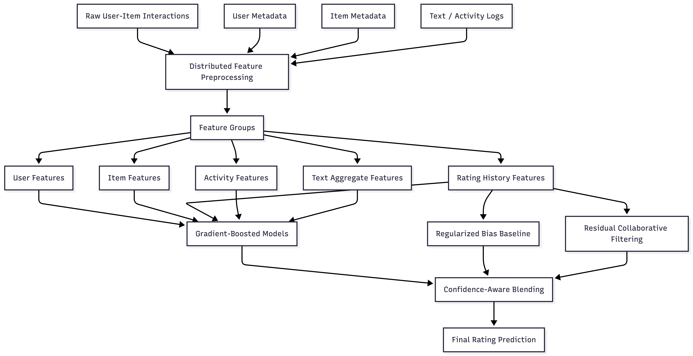

# Large-Scale Hybrid Recommendation Engine


A portfolio case study of a Spark + XGBoost hybrid recommender for large-scale user-business rating prediction.

The system improved validation RMSE from approximately `0.9820` to `0.9738` by combining leakage-aware feature engineering, regularized user/business bias modeling, residual collaborative filtering, and memory-conscious model training.

## Project Context and Repository Scope

This project originated as a graduate course final project. To comply with course policy and academic integrity requirements, this public repository intentionally does not include course-provided data, assignment-specific scripts, full solution code, generated prediction files, or private experimental logs.

Instead, the repository is structured as a portfolio case study. It includes sanitized design notes, feature schema examples, a high-level pipeline skeleton, a residual collaborative filtering demo, and evaluation summaries that explain the modeling and engineering decisions without exposing protected assignment materials.

## At a Glance

| Area | Details |
|---|---|
| Problem | Large-scale user-business rating prediction |
| Main approach | Hybrid recommender with metadata models, bias baseline, and residual collaborative filtering |
| Data processing | Spark-based preprocessing and feature aggregation |
| Modeling | Multi-view XGBoost regression with confidence-aware blending |
| Key engineering focus | Target-leakage prevention, cold-start handling, memory/runtime optimization |
| Result | Validation RMSE improved from `~0.9820` to `~0.9738` |

## Overview

This project explores a hybrid recommendation architecture for user-business rating prediction at scale. The system combines metadata-based machine learning, regularized user/business bias modeling, residual collaborative filtering, and lightweight text-derived aggregate features.

The goal was to improve prediction accuracy while keeping the pipeline efficient enough to run under constrained compute and memory environments.

## What I Implemented

- Built a Spark-based preprocessing pipeline for large-scale user-business interaction data.
- Designed user, business, activity, review-text, category, and historical rating feature groups.
- Constructed leakage-aware historical aggregates so training features would not directly reveal the target label.
- Trained gradient-boosted regression models over multiple feature views.
- Added regularized user/business bias terms for cold-start fallback and baseline prediction.
- Used residual collaborative filtering to model neighborhood-based deviations from the bias baseline.
- Blended metadata, bias, and collaborative signals based on history availability and confidence.
- Improved validation RMSE from approximately `0.9820` to `0.9738`.
- Optimized memory and runtime with `float32` matrices, staged model cleanup, and histogram-based XGBoost training.

## Tech Stack

- Python
- PySpark
- XGBoost
- NumPy
- Collaborative Filtering
- Feature Engineering
- Recommender Systems
- Large-scale ML Pipelines

## System Design

The system combines three complementary prediction sources:

1. **Metadata-based ML model**  
   Learns from user features, business features, activity signals, review-text aggregates, and historical rating statistics.

2. **Regularized bias baseline**  
   Captures user and business rating tendencies while reducing overfitting for sparse users or businesses.

3. **Residual collaborative filtering**  
   Uses neighborhood-based signals to model deviations from the bias baseline.

The final prediction is produced by blending these components based on confidence and cold-start conditions.

See [`docs/model_architecture.md`](docs/model_architecture.md) for more details.

## Feature Engineering

The feature pipeline includes several groups of signals:

- User metadata and activity features
- Business metadata and activity features
- User/business historical rating statistics
- Smoothed baseline features
- Lightweight review-text aggregate features
- Category and interaction features
- Cold-start indicators

For training rows, historical aggregates are designed to avoid directly leaking the target label into the feature vector.

See [`docs/feature_engineering.md`](docs/feature_engineering.md) for more details.

## Model Architecture

The final architecture follows a hybrid design:

```text
Raw user/business data
        │
        ▼
Spark-based preprocessing
        │
        ▼
Feature groups
        │
        ├── Metadata features
        ├── Rating history features
        ├── Activity features
        └── Text aggregate features
        │
        ▼
Multi-view XGBoost models
        │
        ├── Bias baseline
        └── Residual collaborative filtering
        │
        ▼
Confidence-aware blending
        │
        ▼
Final rating prediction
```

### Architecture Diagram


## Evaluation and Impact

The system was evaluated using RMSE for rating prediction.

| Model Version | RMSE |
|---|---:|
| Metadata + XGBoost baseline | ~0.9820 |
| Hybrid model with bias and CF signals | ~0.975 |
| Final multi-view hybrid model | ~0.9738 |

The final model reduced RMSE by approximately `0.0082` compared with the metadata-only baseline, or about `0.84%` relative improvement. The improvement came from combining several stable signals rather than relying on a single model change.

The largest remaining errors were concentrated in extreme ratings, especially unexpected 1-star and 5-star cases. This is common in rating prediction because extreme user experiences often depend on event-specific context that may not be fully captured by historical metadata.

See [`docs/evaluation.md`](docs/evaluation.md) for more details.

## Engineering Challenges and Trade-Offs

Key engineering challenges included:

- Handling large user/business metadata files efficiently
- Preventing feature leakage from historical aggregates
- Balancing model accuracy with runtime and memory constraints
- Combining model-based and collaborative filtering signals
- Improving cold-start robustness
- Managing large intermediate matrices during model training

## Documentation

| File | What it covers |
|---|---|
| [`docs/system_design.md`](docs/system_design.md) | End-to-end pipeline design and engineering constraints |
| [`docs/model_architecture.md`](docs/model_architecture.md) | Hybrid modeling strategy, bias baseline, residual CF, and blending |
| [`docs/feature_engineering.md`](docs/feature_engineering.md) | Feature groups, smoothed aggregates, text features, and leakage prevention |
| [`docs/evaluation.md`](docs/evaluation.md) | RMSE results, error patterns, lessons learned, and future improvements |
| [`src/pipeline_skeleton.py`](src/pipeline_skeleton.py) | High-level pipeline structure without protected assignment implementation |
| [`src/residual_cf_demo.py`](src/residual_cf_demo.py) | Simplified residual collaborative filtering example |
| [`src/feature_schema.py`](src/feature_schema.py) | Sanitized feature group schema |

## What I Learned

This project helped me understand how to build a practical recommender system that combines machine learning, collaborative filtering, feature engineering, and systems-level optimization.

The most important lesson was that recommendation quality improved not from a single model, but from combining multiple stable signals: user/business bias, metadata features, rating history, text aggregates, and neighborhood-based residuals.
